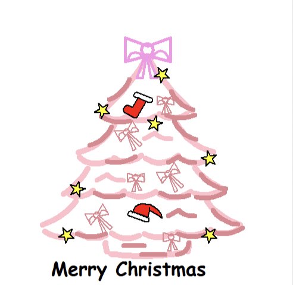
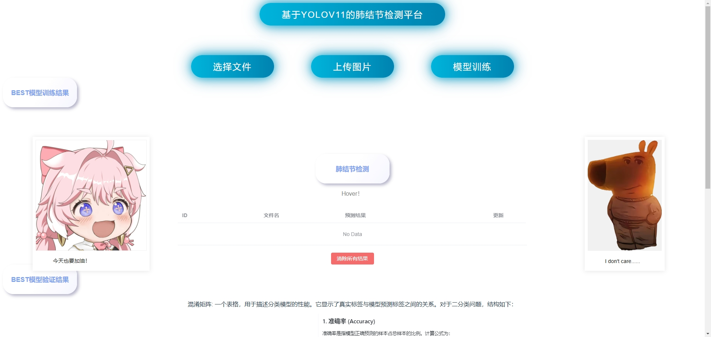
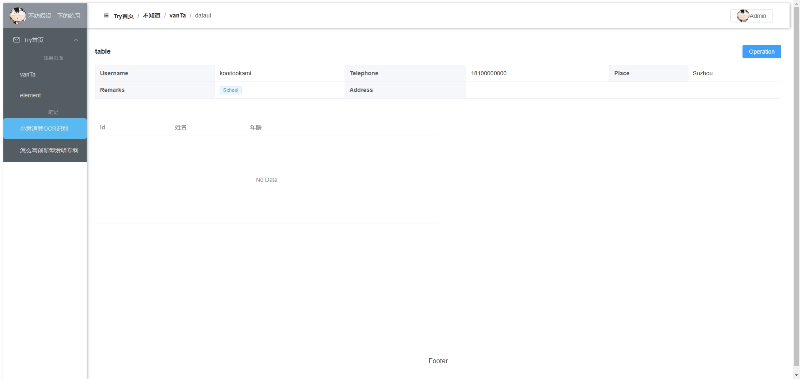
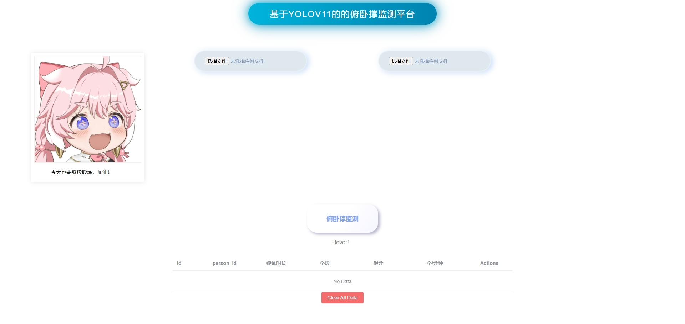
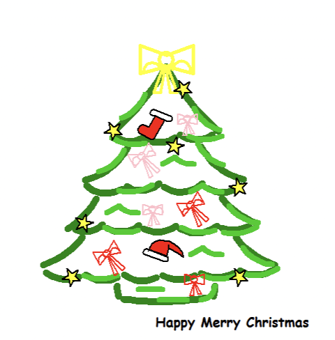
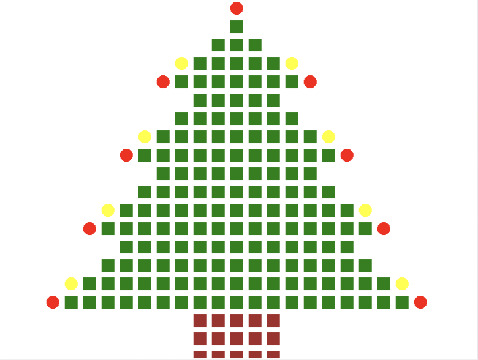
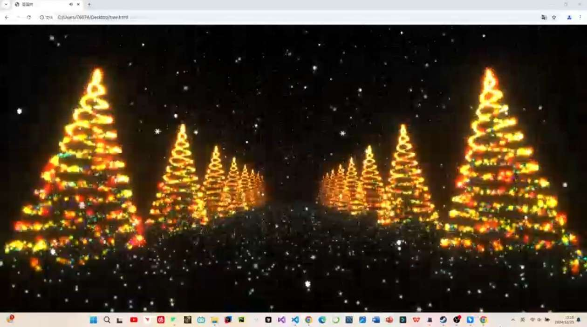

# yun
# 一些练习实践，vanta.js,threejs,vuedataui,d-player,验证码登录注册，基础系统模板。yolov11姿态估计检测,肺结节检测分割，助贷CRM系统。圣诞树。
## Project setup  Compiles and hot-reloads for development  Compiles and minifies for production
```
git clone https://github.com/yunllll/yun.git 然后执行
npm install  npm run serve npm run build
```

### 内容展示









See [Configuration Reference](https://cli.vuejs.org/config/).
